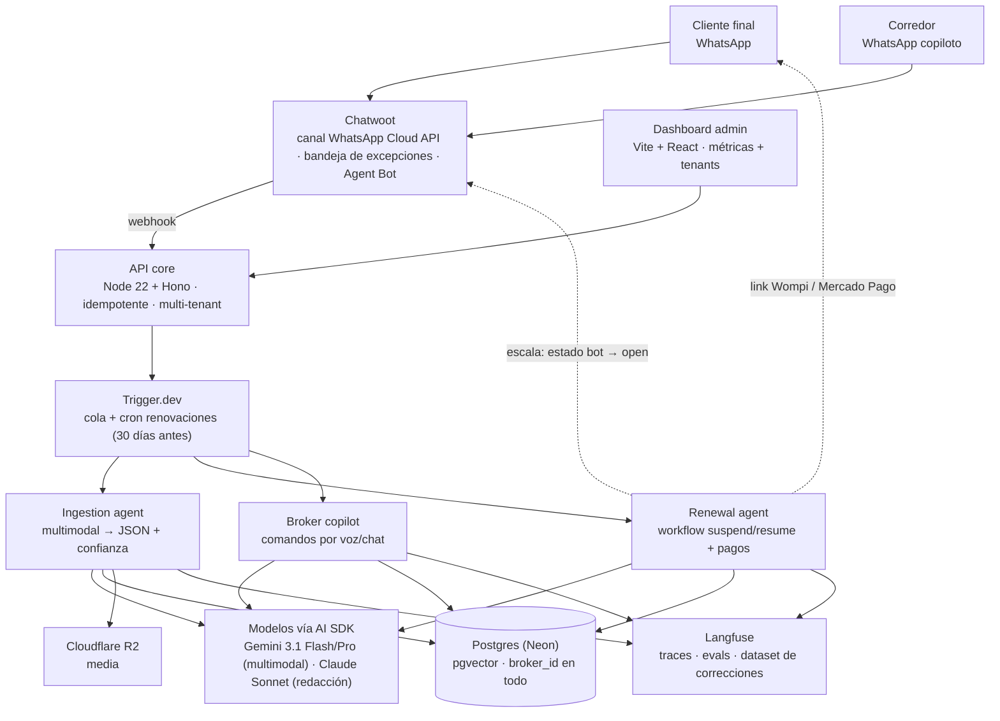

# DIRUS

**El sistema operativo invisible que automatiza el trabajo pesado de las agencias de seguros mediante Inteligencia Artificial.**

> Versión 1.0 · Agosto 2026 · Documento fundacional de arquitectura e ingeniería

```
┌─────────────────────────────────────────────────────────────────────────┐
│                              MANIFIESTO DIRUS                           │
├─────────────────────────────────────────────────────────────────────────┤
│ Los corredores no necesitan más dashboards para llenar formularios.     │
│ Necesitan un motor que trabaje mientras ellos venden.                   │
│                                                                         │
│ DIRUS es invisible:                                                     │
│ Escucha en notas de voz, lee en fotos de WhatsApp y ejecuta             │
│ transacciones en segundo plano.                                         │
│                                                                         │
│ Menos fricción operativa. Cero burocracia. Multiplicador x10.           │
└─────────────────────────────────────────────────────────────────────────┘
```

---

## 1. Visión técnica

DIRUS **no es un CRM**. Es un motor de ejecución autónomo con interfaz invisible: el corredor y su cliente final interactúan por WhatsApp (voz, fotos, texto) y los agentes de IA ejecutan el trabajo operativo en segundo plano — extracción de datos, renovaciones, cobros, escalamiento.

Este documento es la fuente de verdad técnica de la plataforma: toda decisión de arquitectura, esquema de datos y despliegue del MVP vive aquí.

### Principios de diseño

1. **La interfaz es WhatsApp.** Toda funcionalidad debe ser operable por chat/voz. Una pantalla solo existe si el chat no puede resolverla (excepciones y métricas).
2. **Zero-touch por defecto, humano por excepción.** Los agentes resuelven el ~95% de las conversaciones. El humano solo ve lo que requiere juicio. El éxito se mide en cuántas conversaciones _nunca_ llegan a la bandeja.
3. **Extracción con confianza, nunca con adivinanza.** Toda salida de modelo pasa por schema Zod + score de confianza por campo. Bajo el umbral → el agente repregunta, no inventa.
4. **El moat es el dataset, no el modelo.** Cada corrección humana es un activo. La arquitectura la captura por diseño (data flywheel).
5. **Multi-tenant desde la línea 1.** `broker_id` en toda tabla, RLS como segunda defensa. Un cliente nuevo es configuración, no código.
6. **Fuente de verdad propia.** Las herramientas de terceros (Chatwoot) son espejos operativos reemplazables. Los datos viven en Postgres de DIRUS.

---

## 2. Alcance del MVP e hipótesis de validación

El MVP son **tres componentes**, nada más:

| Componente | Qué hace | Hipótesis que valida |
|:--|:--|:--|
| **Ingesta multimodal** | Notas de voz, fotos (cédulas, placas, carátulas) y PDFs por WhatsApp → JSON estructurado | H3: >95% de precisión en campos clave |
| **Motor de renovaciones zero-touch** | Detecta vencimientos → campaña conversacional → link de pago → escala solo con fricción | H2: >25% de aumento en renovaciones tempranas |
| **Copiloto del corredor** | El broker opera por audio/chat: consultas, comandos, reenvío de documentos | H1: >70% de interacciones del broker vía voz/chat |

Fuera de alcance del MVP: siniestros complejos, cross-selling automatizado, doc center con RAG, cotización multi-aseguradora en tiempo real. (Fases posteriores, sección 14.)

---

## 3. Decisiones de arquitectura (resumen ADR)

| # | Decisión | Elegido | Alternativas descartadas | Razón principal |
|:--|:--|:--|:--|:--|
| ADR-1 | Framework de agentes | **Mastra** | ADK-TS, LangGraph.js | Workflows `suspend/resume` nativos (renovaciones viven semanas), human-in-the-loop de primera clase, evals integrados, sobre AI SDK (model-agnostic) |
| ADR-2 | Capa de modelos | **Vercel AI SDK** con routing por tarea | SDK de un solo proveedor | Cambiar de modelo es configuración, no refactor |
| ADR-3 | Canal WhatsApp | **Meta Cloud API vía Chatwoot** | Twilio, integración directa | Sin markup por mensaje; Chatwoot regala bandeja, contactos y apps móviles |
| ADR-4 | Bandeja de excepciones | **Chatwoot (Agent Bot)** | Bandeja propia | Ahorra 4-6 semanas de UI; patrón `bot → open` con contexto completo. Datos propios como fuente de verdad hacen la migración futura barata |
| ADR-5 | Cola y crons | **Trigger.dev Cloud** | BullMQ + Redis propio | Jobs largos, retries, cron y observabilidad sin operar Redis |
| ADR-6 | Base de datos | **Postgres (Neon) + Drizzle + pgvector** | Supabase, Mongo | Transaccional + vectores en una sola DB; branching para dev; backups managed |
| ADR-7 | Observabilidad IA | **Langfuse Cloud** | Self-hosted, LangSmith | v3 self-hosted exige Clickhouse+Redis+S3; free tier suficiente para piloto |
| ADR-8 | Media | **Cloudflare R2** | S3 | Sin costo de egreso; los media IDs de Meta expiran → descarga inmediata obligatoria |
| ADR-9 | Despliegue | **VPS Hetzner (Docker+Caddy) + estado managed** | Todo PaaS, todo VPS, K8s | El cómputo es descartable, el estado nunca depende de un volumen de VPS |
| ADR-10 | Repositorio | **Monorepo pnpm** | Multi-repo | Tipos, Zod y cliente DB compartidos entre agentes, API y dashboard |

---

## 4. Arquitectura del sistema



### Flujos clave

1. **Entrada:** todo mensaje (texto, audio, foto, PDF) entra por el número WhatsApp del broker → Chatwoot → webhook al API (verificación + dedup por `wa_message_id`) → resolución de tenant por `wa_phone_number_id` → cola → agente correspondiente.
2. **Escalamiento inverso:** cuando un agente decide escalar, cambia la conversación en Chatwoot de `bot` a `open` — aparece en la bandeja del humano con todo el contexto. El motivo queda en `conversations.escalation_reason`.
3. **Flywheel:** cada corrección del broker en Chatwoot regresa por webhook → `extractions.corrected_output` → dataset en Langfuse.
4. **Pagos:** el Renewal Agent envía links de Wompi/Mercado Pago directo en el chat. DIRUS nunca procesa pagos.
5. **Ventana 24h:** mensajes proactivos (renovaciones) solo con plantillas HSM aprobadas; respuestas dentro de la ventana son libres. `conversations.window_expires_at` gobierna la decisión.

### Rol de Chatwoot (y su límite)

Chatwoot es dueño operativo del canal: conexión Cloud API, contactos, historial visual, bandeja con apps móviles. Los agentes DIRUS se conectan como **Agent Bot** vía API. Se opera como infraestructura (Docker Compose oficial, sin fork). Una cuenta Chatwoot por broker, provisionada por API en el onboarding.

**Límite explícito:** si los brokers empiezan a vivir en la bandeja respondiendo a mano, DIRUS se convirtió en "otro inbox" y la tesis murió. KPI de guardia: % de conversaciones resueltas sin intervención humana.

---

## 5. Los agentes

### 5.1 Ingestion Agent

- **Entrada:** audio (nota de voz), imagen (cédula, placa, carátula, tarjeta de propiedad), PDF.
- **Proceso:** clasificación del documento → extracción multimodal (Gemini) → validación Zod → score de confianza por campo.
- **Salida:** registro en `extractions` + upsert en `contacts`/`policies`. Confianza < umbral en algún campo → `needs_review = true` y el agente repregunta por WhatsApp ("La foto quedó borrosa, ¿me la reenvías?").
- **Regla:** todo input y output se persiste (R2 + Langfuse). Cada extracción es una fila futura del golden dataset.

### 5.2 Renewal Agent (el corazón del negocio)

- **Disparo:** cron diario detecta pólizas con `end_date` a 30 días → crea `renewals` (idempotente por `UNIQUE(policy_id, due_date)`).
- **Workflow Mastra por póliza:** plantilla HSM contextual → `suspend` esperando respuesta → maneja objeción (Claude Sonnet) o envía link de pago → confirma → cierra. El workflow vive días o semanas; el estado se persiste.
- **Escalamiento:** objeción no resuelta en N turnos, solicitud explícita de humano, o intención de cancelar → `bot → open` en Chatwoot + `renewals.status = 'escalated'`.
- **Máquina de estados:** `pending → contacted → negotiating → payment_sent → paid | escalated | lost`. La H2 se mide con un `GROUP BY status`.

### 5.3 Broker Copilot

- **Entrada:** mensajes del corredor a su número DIRUS (identificado por `broker_users.phone`).
- **Intents:** ingesta delegada (reenvía audio/foto de un cliente), consultas ("¿qué renovaciones tengo esta semana?"), comandos ("mándale recordatorio a Carlos").
- **Valida H1** midiendo qué % de la operación del broker pasa por aquí vs. el dashboard.

---

## 6. Modelos de IA: routing por tarea

| Tarea | Modelo | Razón |
|:--|:--|:--|
| Extracción de fotos, PDFs y **notas de voz** | **Gemini 3.1 Flash** (default) / **3.1 Pro** (baja confianza o docs complejos) | Multimodal nativo: procesa el audio de WhatsApp directo, sin pipeline STT. Líder en parsing de documentos. Barato |
| Conversación de volumen (renovación, cotización) | **Gemini 3.5 Flash** o **Claude Haiku** | Latencia baja, costo mínimo por conversación |
| Redacción sensible y manejo de objeciones | **Claude Sonnet** | Mejor español, mejor juicio para detectar cuándo escalar |
| Clasificación / routing de intents | Modelo mini (Flash-lite / Haiku) | Centavos por millón de tokens |

Reglas transversales:

- **Structured outputs siempre:** `generateObject` del AI SDK + schemas en `packages/schemas`. Nunca parsing de texto libre.
- **Umbral de confianza por campo** (inicial: 0.85, calibrado con evals). Bajo umbral → repreguntar.
- **Escalada de modelo:** si Flash falla la validación Zod o da baja confianza, reintento automático con Pro antes de repreguntar al usuario.
- **Open source (Llama, DeepSeek) solo post-validación**, si el costo por conversación lo justifica. No antes.

---

## 7. Esquema de datos

**Principio:** las tablas DIRUS son la fuente de verdad de conversaciones y mensajes desde el día 1, con o sin Chatwoot. Chatwoot se referencia por columnas `chatwoot_*` (nullable). Salir de Chatwoot = reemplazar UI, no reconstruir datos.

### 7.1 Núcleo compartido

```sql
-- Tenants. broker_id aparece en TODAS las demás tablas.
CREATE TABLE brokers (
  id              uuid PRIMARY KEY DEFAULT gen_random_uuid(),
  name            text NOT NULL,
  wa_phone_number_id text UNIQUE NOT NULL,  -- resuelve el tenant en cada webhook
  waba_id         text NOT NULL,
  plan            text NOT NULL DEFAULT 'pilot',
  status          text NOT NULL DEFAULT 'active',
  created_at      timestamptz NOT NULL DEFAULT now()
);

-- Staff del broker (asesores que atienden excepciones)
CREATE TABLE broker_users (
  id         uuid PRIMARY KEY DEFAULT gen_random_uuid(),
  broker_id  uuid NOT NULL REFERENCES brokers(id),
  name       text NOT NULL,
  phone      text NOT NULL,          -- su WhatsApp para el copiloto
  role       text NOT NULL DEFAULT 'agent',  -- owner | agent
  created_at timestamptz NOT NULL DEFAULT now(),
  UNIQUE (broker_id, phone)
);

-- Clientes finales (asegurados)
CREATE TABLE contacts (
  id           uuid PRIMARY KEY DEFAULT gen_random_uuid(),
  broker_id    uuid NOT NULL REFERENCES brokers(id),
  phone        text NOT NULL,
  full_name    text,
  doc_type     text,                 -- CC | CE | NIT
  doc_number   text,
  consent_at   timestamptz,          -- Habeas Data: consentimiento explícito
  created_at   timestamptz NOT NULL DEFAULT now(),
  UNIQUE (broker_id, phone)
);

CREATE TABLE conversations (
  id                uuid PRIMARY KEY DEFAULT gen_random_uuid(),
  broker_id         uuid NOT NULL REFERENCES brokers(id),
  contact_id        uuid REFERENCES contacts(id),        -- null si es copiloto
  broker_user_id    uuid REFERENCES broker_users(id),    -- set si es copiloto
  kind              text NOT NULL,   -- customer | copilot
  status            text NOT NULL DEFAULT 'bot',  -- bot | human | resolved
  escalation_reason text,
  window_expires_at timestamptz,     -- ventana 24h de WhatsApp
  last_message_at   timestamptz,
  created_at        timestamptz NOT NULL DEFAULT now()
);

CREATE TABLE messages (
  id              uuid PRIMARY KEY DEFAULT gen_random_uuid(),
  broker_id       uuid NOT NULL REFERENCES brokers(id),
  conversation_id uuid NOT NULL REFERENCES conversations(id),
  direction       text NOT NULL,     -- inbound | outbound
  sender          text NOT NULL,     -- contact | agent_bot | human | system
  type            text NOT NULL,     -- text | audio | image | document | template
  body            text,
  media_r2_key    text,              -- media SIEMPRE en R2 (los media IDs de Meta expiran)
  wa_message_id   text UNIQUE,       -- idempotencia de webhooks: dedup aquí
  template_name   text,              -- si type = template (HSM)
  created_at      timestamptz NOT NULL DEFAULT now()
);
CREATE INDEX ON messages (conversation_id, created_at);

-- Pólizas: el objeto de negocio central
CREATE TABLE policies (
  id             uuid PRIMARY KEY DEFAULT gen_random_uuid(),
  broker_id      uuid NOT NULL REFERENCES brokers(id),
  contact_id     uuid NOT NULL REFERENCES contacts(id),
  insurer        text NOT NULL,      -- Sura, Bolívar, Allianz...
  line           text NOT NULL,      -- auto | vida | hogar | salud | soat
  policy_number  text,
  plate          text,               -- líneas de auto
  premium_amount numeric(14,2),
  currency       text NOT NULL DEFAULT 'COP',
  commission_pct numeric(5,2),
  start_date     date,
  end_date       date NOT NULL,      -- dispara el cron de renovación
  status         text NOT NULL DEFAULT 'active',  -- active | expired | cancelled
  created_at     timestamptz NOT NULL DEFAULT now()
);
CREATE INDEX ON policies (broker_id, end_date) WHERE status = 'active';

-- Documentos fuente (carátulas, cédulas, tarjetas de propiedad)
CREATE TABLE documents (
  id         uuid PRIMARY KEY DEFAULT gen_random_uuid(),
  broker_id  uuid NOT NULL REFERENCES brokers(id),
  policy_id  uuid REFERENCES policies(id),
  contact_id uuid REFERENCES contacts(id),
  message_id uuid REFERENCES messages(id),  -- de qué mensaje llegó
  r2_key     text NOT NULL,
  mime_type  text NOT NULL,
  doc_class  text,                   -- caratula | cedula | tarjeta_propiedad | factura
  created_at timestamptz NOT NULL DEFAULT now()
);

-- El corazón del flywheel: cada extracción y su corrección
CREATE TABLE extractions (
  id               uuid PRIMARY KEY DEFAULT gen_random_uuid(),
  broker_id        uuid NOT NULL REFERENCES brokers(id),
  document_id      uuid REFERENCES documents(id),
  message_id       uuid REFERENCES messages(id),   -- para notas de voz
  model            text NOT NULL,    -- gemini-3.1-flash, etc.
  output           jsonb NOT NULL,   -- JSON validado por Zod
  confidence       jsonb NOT NULL,   -- score por campo
  needs_review     boolean NOT NULL DEFAULT false, -- confianza < umbral
  corrected_output jsonb,            -- lo que el humano corrigió = dato de oro
  corrected_by     uuid REFERENCES broker_users(id),
  langfuse_trace_id text,
  created_at       timestamptz NOT NULL DEFAULT now()
);
CREATE INDEX ON extractions (broker_id, needs_review) WHERE needs_review = true;

-- Estado del workflow de renovación (el negocio vive aquí)
CREATE TABLE renewals (
  id              uuid PRIMARY KEY DEFAULT gen_random_uuid(),
  broker_id       uuid NOT NULL REFERENCES brokers(id),
  policy_id       uuid NOT NULL REFERENCES policies(id),
  conversation_id uuid REFERENCES conversations(id),
  due_date        date NOT NULL,
  workflow_run_id text,              -- id del run en Trigger.dev/Mastra
  status          text NOT NULL DEFAULT 'pending',
  -- pending | contacted | negotiating | payment_sent | paid | escalated | lost
  payment_link    text,
  paid_at         timestamptz,
  escalated_at    timestamptz,
  created_at      timestamptz NOT NULL DEFAULT now(),
  UNIQUE (policy_id, due_date)       -- idempotencia del cron
);

-- Fase C: RAG del doc center
CREATE TABLE doc_chunks (
  id          uuid PRIMARY KEY DEFAULT gen_random_uuid(),
  broker_id   uuid NOT NULL REFERENCES brokers(id),
  document_id uuid NOT NULL REFERENCES documents(id),
  chunk_text  text NOT NULL,
  embedding   vector(768),
  created_at  timestamptz NOT NULL DEFAULT now()
);
```

**Multi-tenancy:** `broker_id` en toda tabla + Row Level Security (`SET app.broker_id` por request) como segunda línea de defensa. Un `WHERE` olvidado no filtra datos de otro broker.

### 7.2 Escenario A — con Chatwoot (espejo, el escenario del MVP)

Columnas adicionales, todas nullable. Referencias, nunca fuente de verdad:

```sql
ALTER TABLE brokers       ADD COLUMN chatwoot_account_id  integer UNIQUE;
ALTER TABLE contacts      ADD COLUMN chatwoot_contact_id  integer;
ALTER TABLE conversations ADD COLUMN chatwoot_conversation_id integer;
ALTER TABLE messages      ADD COLUMN chatwoot_message_id  integer;
```

Sincronización: los webhooks de Chatwoot escriben en tablas DIRUS; cuando un agente responde, escribe en tablas DIRUS y envía vía API de Chatwoot. `conversations.status` se espeja con Chatwoot (`bot` ↔ `open`). Correcciones humanas llegan por webhook y aterrizan en `extractions.corrected_output`.

### 7.3 Escenario B — sin Chatwoot (motor propio, ruta de salida)

Se eliminan las columnas `chatwoot_*` y se agrega lo que Chatwoot resolvía:

```sql
-- Asignación de excepciones en bandeja propia
ALTER TABLE conversations ADD COLUMN assigned_to uuid REFERENCES broker_users(id);
ALTER TABLE messages      ADD COLUMN sent_by     uuid REFERENCES broker_users(id);

-- Registro de plantillas HSM
CREATE TABLE wa_templates (
  id          uuid PRIMARY KEY DEFAULT gen_random_uuid(),
  broker_id   uuid NOT NULL REFERENCES brokers(id),
  name        text NOT NULL,
  category    text NOT NULL,         -- utility | marketing
  language    text NOT NULL DEFAULT 'es',
  body        text NOT NULL,
  meta_status text NOT NULL,         -- pending | approved | rejected
  created_at  timestamptz NOT NULL DEFAULT now(),
  UNIQUE (broker_id, name, language)
);

-- Estado crudo de webhooks de Meta (statuses: sent/delivered/read/failed)
CREATE TABLE wa_message_events (
  id            uuid PRIMARY KEY DEFAULT gen_random_uuid(),
  wa_message_id text NOT NULL,
  event         text NOT NULL,
  payload       jsonb NOT NULL,
  created_at    timestamptz NOT NULL DEFAULT now()
);
```

Más el costo no-SQL: UI de bandeja con realtime (SSE), integración directa con Meta (firma de webhook, descarga inmediata de media a R2, gestión de plantillas por API).

**Ruta de migración A → B:** dropear 4 columnas, 3 migraciones, construir la bandeja. Cero migración de datos.

---

## 8. Data flywheel y evals

El moat de DIRUS no es el modelo — es el **dataset de correcciones reales colombianas** (fotos malas, jerga, acentos) que ningún competidor tiene. Cuatro niveles, en orden:

1. **Captura total (día 1):** cada trace — input crudo, extracción, confianza, resultado — va a Langfuse. Sin esto, nada más existe.
2. **Correcciones humanas = oro:** cada corrección en la bandeja es un dato etiquetado gratis que aterriza en `extractions.corrected_output` y en el golden dataset. La UX de corregir debe ser un tap.
3. **Few-shot dinámico antes que fine-tuning:** recuperar los 3-5 ejemplos corregidos más similares al input (embeddings + pgvector) e inyectarlos al prompt. Medible, reversible, sin entrenar nada. Aplica también a objeciones de renovación que convirtieron.
4. **Fine-tuning solo con ~1,000+ ejemplos:** modelo pequeño para la extracción específica. Es optimización de costo/latencia, no MVP.

### Evals (no opcional — validan la H3)

- **Golden dataset:** 200 documentos/audios **reales** de los brokers piloto. Primeras 20 muestras antes de escribir el primer prompt.
- **Métrica:** precision/recall **por campo** (nombre, cédula, placa, vigencia, aseguradora), con Mastra evals o promptfoo.
- **Gate en CI:** todo cambio de prompt o modelo corre contra el dataset antes de deploy. Regresión de precisión = build rojo.

---

## 9. Estructura del monorepo

Monorepo pnpm. Agentes, API y dashboard comparten tipos, schemas Zod y cliente de DB.

```
dirus/
├── apps/
│   ├── api/                  # Hono: webhooks Chatwoot/Meta, REST para dashboard
│   │   ├── src/
│   │   │   ├── routes/       # webhooks/, admin/, health
│   │   │   ├── middleware/   # auth, tenant-resolver (wa_phone_number_id → broker_id)
│   │   │   └── index.ts
│   │   └── Dockerfile
│   ├── dashboard/            # Vite + React (admin + métricas). Build estático
│   └── jobs/                 # Tareas Trigger.dev
│       └── trigger/          # renewal-cron.ts, process-media.ts, sync-chatwoot.ts
├── packages/
│   ├── agents/               # Mastra: ingestion, renewal, copilot + workflows
│   ├── db/                   # Drizzle: schema.ts (sección 7), migraciones, cliente
│   ├── schemas/              # Zod compartidos: extracción, webhooks, API contracts
│   ├── integrations/         # Clientes tipados: chatwoot.ts, meta-wa.ts, wompi.ts
│   └── config/               # tsconfig base, eslint, constantes
├── infra/
│   ├── docker-compose.yml         # dev local
│   ├── docker-compose.prod.yml    # VPS
│   └── Caddyfile
├── pnpm-workspace.yaml
└── turbo.json                # opcional: cache de builds
```

Reglas de dependencia: `apps/*` importa de `packages/*`, nunca al revés, y nunca entre apps. `packages/schemas` no importa nada — es la base de todo.

---

## 10. Infraestructura y despliegue

**Decisión central: el estado vive en servicios managed, el cómputo en el VPS.** El VPS es casi descartable — si muere, se recrea con compose sin perder nada crítico.

| Pieza | Dónde | Por qué |
|:--|:--|:--|
| API + Chatwoot + Caddy | **VPS Hetzner CX32/CPX31** (~8GB RAM, ~€15/mes) | Chatwoot es hambriento (Rails + Sidekiq); 8GB da aire. Docker + Caddy es stack conocido |
| Postgres DIRUS | **Neon** | Backups, branching para dev, PITR. La data crítica jamás depende de un volumen de VPS |
| Postgres/Redis de Chatwoot | Volúmenes del VPS | Data operativa espejada; backup diario con restic → R2 igual |
| Jobs y crons | **Trigger.dev Cloud** | Self-hostearlo es otro stack completo; free tier suficiente para el piloto |
| Langfuse | **Langfuse Cloud** (free tier) | v3 self-hosted exige Clickhouse + Redis + S3 — sobrecarga absurda para MVP |
| Media | **Cloudflare R2** | Sin costo de egreso |
| Dashboard | Estático en el VPS vía Caddy | Cero infra extra |

### Docker: sí, pero solo donde aporta

- **Chatwoot lo exige:** su Docker Compose oficial, intocado.
- **API DIRUS:** Dockerfile multi-stage (pnpm + Node 22 slim).
- **Dashboard NO:** build estático servido por Caddy.
- **Jobs NO:** Trigger.dev Cloud los ejecuta (`npx trigger.dev deploy`).
- **Dev local:** `docker compose up` levanta Chatwoot + Redis; API y dashboard con `pnpm dev` fuera de Docker (hot reload). Webhooks de Meta en dev: túnel cloudflared.

```yaml
# infra/docker-compose.prod.yml (esqueleto)
services:
  caddy:
    image: caddy:2
    ports: ["80:80", "443:443"]
    volumes: ["./Caddyfile:/etc/caddy/Caddyfile", "caddy_data:/data", "../apps/dashboard/dist:/srv/dashboard"]
  api:
    image: ghcr.io/khriztianmoreno/dirus-api:latest
    env_file: .env.prod
    restart: unless-stopped
  # chatwoot: include del compose oficial (rails, sidekiq, postgres, redis)
```

Caddy enruta: `api.dirus.io` → API, `app.dirus.io` → dashboard estático, `inbox.dirus.io` → Chatwoot. TLS automático.

### CI/CD: GitHub Actions

1. Push a `main` → lint + typecheck + **evals contra el golden dataset** (gate de calidad).
2. Build imagen API → GHCR. Build dashboard → artefacto.
3. Deploy: SSH al VPS → `docker compose pull && docker compose up -d` + rsync del dashboard. Trigger.dev con su CLI en el mismo workflow.
4. Migraciones Drizzle contra Neon (`drizzle-kit migrate`) en el paso de deploy.

Secretos: GitHub Environments para CI, `.env.prod` en el VPS (Infisical si se quiere central). Nunca secretos en la imagen.

### Alternativas descartadas

- **Todo managed (Railway/Fly/Vercel):** Chatwoot en PaaS es caro y frágil (Sidekiq + websockets). Terminas con un VPS solo para Chatwoot — mejor todo ahí.
- **Todo en VPS:** ahorra ~$20/mes a cambio de asumir backups, PITR y upgrades de la data más crítica. Mal trade.
- **Kubernetes:** no, a esta escala.

---

## 11. Seguridad y cumplimiento

- **Habeas Data (Ley 1581, Colombia):** DIRUS maneja cédulas y, en fases futuras de siniestros, datos médicos (dato sensible). Consentimiento explícito en el primer contacto (`contacts.consent_at`), política de retención de media en R2, y proceso de supresión por solicitud del titular. **No opcional para vender a agencias.**
- **Ventana de 24h de WhatsApp:** mensajes proactivos solo con plantillas HSM aprobadas por Meta (utility/marketing). Diseñar y someter plantillas en la semana 1 — la aprobación tarda y es el camino crítico del Renewal Agent.
- **Idempotencia de webhooks:** Meta y Chatwoot reenvían eventos. Dedup por `wa_message_id UNIQUE`; el cron de renovaciones es idempotente por `UNIQUE(policy_id, due_date)`.
- **Aislamiento de tenants:** `broker_id` obligatorio + RLS de Postgres. Tests de integración que verifican que un tenant no lee datos de otro.
- **Media:** descarga inmediata de Meta a R2 (los media IDs expiran), acceso por URLs firmadas de corta vida.
- **Secretos:** nunca en imágenes ni en el repo. Verificación de firma en todos los webhooks entrantes.
- **PII en logs:** los traces a Langfuse llevan referencias (ids), nunca cédulas ni teléfonos en claro en metadatos de texto libre.

---

## 12. Métricas e instrumentación

| Hipótesis | Métrica | Fuente |
|:--|:--|:--|
| H1: interfaz invisible | % de interacciones del broker vía voz/chat vs dashboard | `conversations.kind = 'copilot'` vs eventos del dashboard |
| H2: renovaciones | % de renovaciones tempranas vs baseline del broker | `renewals GROUP BY status` |
| H3: extracción | Precision/recall por campo | Evals sobre golden dataset + tasa de `needs_review` |
| Salud del producto | % conversaciones resueltas sin humano | `conversations.status` al cierre |
| Operación | Time-to-first-renewal-sent por broker nuevo | Onboarding → primer HSM enviado |
| Costo | USD por conversación y por renovación cerrada | Langfuse (tokens) + pricing conversacional de Meta |

Todas visibles en el dashboard admin. Si el onboarding de un broker toma más de un día, es un problema de producto, no de ventas.

---

## 13. Roadmap del MVP

**Semanas 1-3 — Fase A (Ingesta):** Chatwoot en VPS + número de prueba + webhook eco. `packages/db` con schema y migraciones. Ingestion Agent con Langfuse y primeras 20 muestras del golden dataset. Broker Copilot v0. Plantillas HSM sometidas a Meta (en paralelo). Onboarding de 3-5 brokers piloto.

**Semanas 4-6 — Fase B (Renovaciones):** Renewal Agent con workflows suspend/resume. Links de pago Wompi/Mercado Pago. Bandeja de excepciones operando en Chatwoot. Campaña sobre 100 pólizas reales.

**Semanas 7-9 — Fase C (Expansión):** Recepción conversacional de siniestros leves (reusa Ingestion Agent). Triggers de cross-selling por eventos detectados en conversación. Dashboard con las 6 métricas.

**Post-MVP (según validación):** doc center con RAG (`doc_chunks`), cotización multi-aseguradora, fine-tuning del extractor, evaluación de salida de Chatwoot (Escenario B), voz saliente.

### Orden de construcción (literal)

1. Scaffold del monorepo + `packages/db` + migraciones contra Neon.
2. `packages/schemas`: Zod de extracción (carátula, cédula, tarjeta de propiedad).
3. Chatwoot en el VPS + número WhatsApp de prueba + webhook → `apps/api` (eco).
4. Ingestion Agent + Langfuse + 20 primeras muestras del golden dataset.
5. Someter plantillas HSM a Meta (paralelo — camino crítico).
6. Renewal Agent + cron en `apps/jobs`.
7. Dashboard: login, cola de extracciones a revisar, y las métricas.

---

## 14. Riesgos y mitigaciones

| Riesgo | Impacto | Mitigación |
|:--|:--|:--|
| Aprobación de plantillas HSM se demora | Renewal Agent bloqueado | Someter en semana 1; plantillas genéricas pre-aprobadas como fallback |
| Precisión de extracción < 95% en docs reales | H3 falla | Golden dataset desde el día 1, few-shot dinámico, escalada Flash→Pro, repregunta bajo umbral |
| Brokers viven en la bandeja (DIRUS = otro inbox) | Tesis de invisibilidad muere | KPI de guardia: % resuelto sin humano; diseñar el copiloto como camino más corto |
| Dependencia de Chatwoot | Lock-in operativo | Fuente de verdad propia; ruta de salida documentada (7.3) con cero migración de datos |
| Costo por conversación de Meta erosiona márgenes | Unit economics | Medir USD/renovación desde el piloto; priorizar plantillas utility (más baratas que marketing) |
| Datos sensibles mal manejados | Legal + reputacional | Sección 11 completa antes del primer broker pagando |

---

## 15. Costos del piloto (3-5 brokers)

- **Infraestructura:** ~€15-25/mes (VPS + dominio; Neon, Trigger.dev, Langfuse y R2 en free tier).
- **LLMs:** decenas de USD/mes a volumen de piloto (Gemini Flash como caballo de batalla).
- **WhatsApp:** variable por conversación iniciada; modelar por renovación.

El costo real del MVP es tiempo de desarrollo, no infraestructura. Eso confirma la tesis: construir esto en 2026 es barato — la ventaja defendible está en el data flywheel (sección 8), no en el código.
